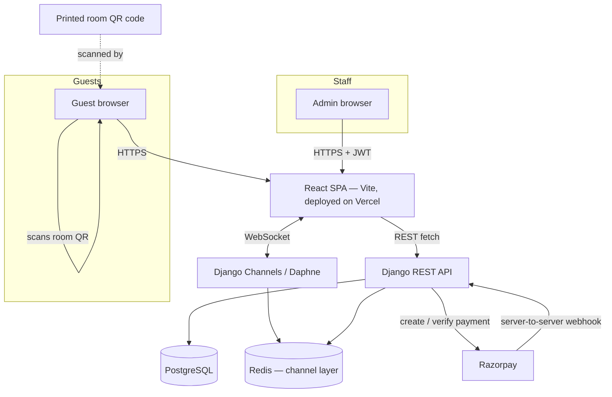
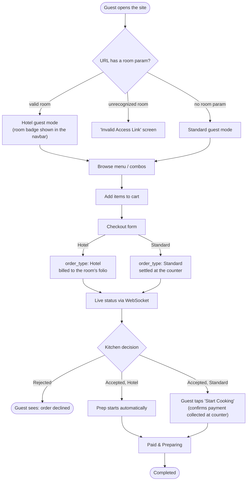
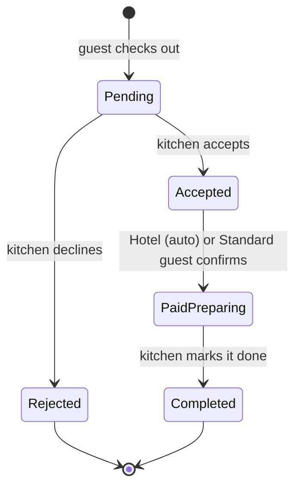
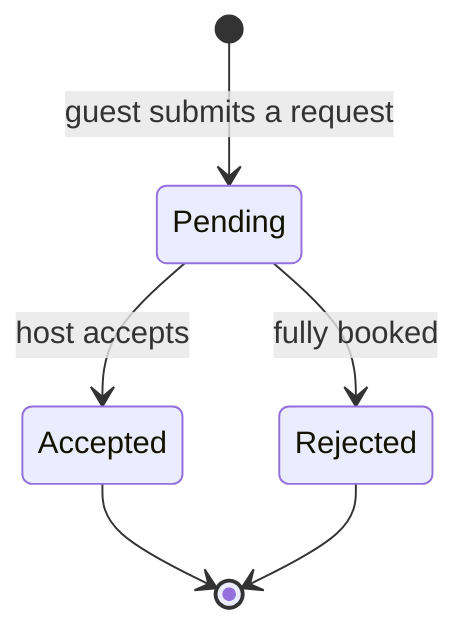
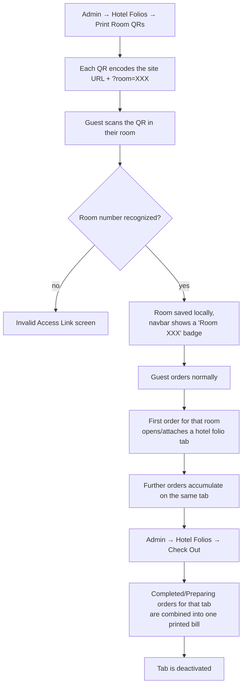
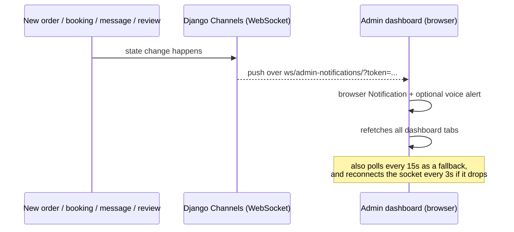
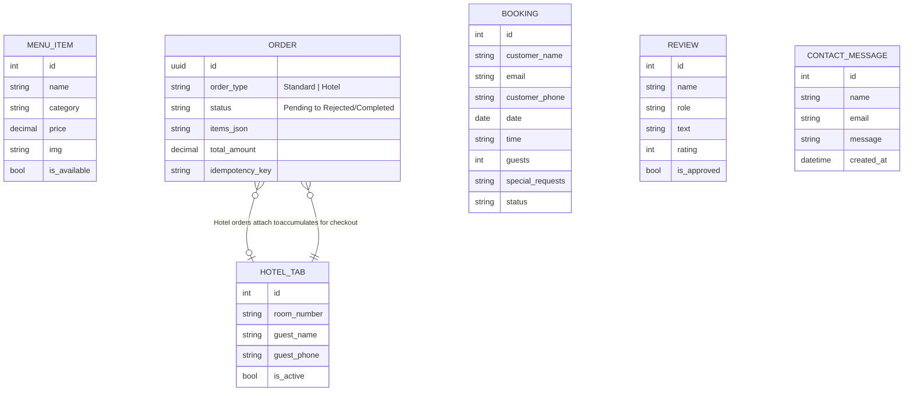
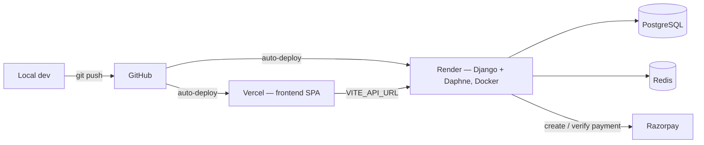

# High Spirits Cafe — Full-Stack Overview

A pure-veg restaurant's ordering platform: a public-facing menu/booking/delivery
site, an in-hotel room-service ordering flow driven by QR codes, live order
and booking tracking over WebSockets, and a single admin dashboard that runs
the kitchen, the front desk, and the till.

This document covers the **frontend** (React/Vite SPA) and the **backend**
(Django REST + Channels API) together, so one page explains how a click on
the menu turns into a printed kitchen ticket. Business-specific details
(the restaurant's actual address, phone number, secret keys, credentials)
are intentionally left out — see [§14](#14-where-business-config-lives) for
where those live instead.

## Table of Contents

1. [What this is](#1-what-this-is)
2. [Architecture at a glance](#2-architecture-at-a-glance)
3. [Tech stack](#3-tech-stack)
4. [Repository / folder structure](#4-repository--folder-structure)
5. [Core flows](#5-core-flows)
6. [API surface](#6-api-surface)
7. [Data model (as seen over the wire)](#7-data-model-as-seen-over-the-wire)
8. [Real-time channels](#8-real-time-channels)
9. [Environment variables](#9-environment-variables)
10. [Local development](#10-local-development)
11. [Deployment](#11-deployment)
12. [Scripts & commands reference](#12-scripts--commands-reference)
13. [Known gaps / integration notes](#13-known-gaps--integration-notes)
14. [Where business config lives](#14-where-business-config-lives)

---

## 1. What this is

Two guest-facing ordering modes share one cart and one kitchen:

| Mode | Who | How they get there | How the bill is settled |
|---|---|---|---|
| **Standard** | Walk-in / online guest | Visits the site directly | Confirmed and paid at the counter |
| **Hotel** | In-room guest | Scans a room QR code (`?room=101`…`108`) | Billed to a running room folio, settled at checkout |

Plus one admin dashboard (JWT-protected, `/admin`) that covers analytics,
live kitchen orders, POS billing, hotel folios, menu management, table
bookings, the contact inbox, and review moderation.

## 2. Architecture at a glance



The frontend and backend are deployed independently (Vercel for the SPA,
Render for the Django/Daphne service) and only ever talk to each other over
the public REST + WebSocket API — there's no shared filesystem or direct DB
access from the frontend.

## 3. Tech stack

### Frontend

| Layer | Choice |
|---|---|
| Framework | React 19, bundled with Vite |
| Routing | react-router-dom |
| Styling | Tailwind CSS + a small hand-written CSS layer (`index.css`) for reveal animations, floating labels, glassmorphism |
| Icons | lucide-react |
| Admin charts | Recharts |
| Smooth scroll | Lenis |
| Toasts | react-hot-toast |
| Real-time | native browser `WebSocket`, no client library |
| Containerized dev | Docker (`node:20-alpine`, Vite dev server on `0.0.0.0:5173`) |
| Hosting | Vercel (SPA rewrite so client-side routes don't 404 on refresh) |

### Backend

| Layer | Choice |
|---|---|
| Framework | Django 6.1 + Django REST Framework |
| Real-time | Django Channels + Daphne (ASGI) |
| Auth | SimpleJWT — staff/admin endpoints only, guests never authenticate |
| Payments | Razorpay |
| Database | PostgreSQL in production (`dj-database-url`), SQLite locally |
| Channel layer | Redis in production, in-memory for local dev |
| API docs | drf-spectacular (OpenAPI schema + Swagger UI) |
| Hosting | Docker image on Render, `entrypoint.sh` runs migrations + `collectstatic` then starts Daphne |

## 4. Repository / folder structure

**Frontend** (verified from the actual source tree):

```
frontend/
├─ index.html
├─ vite.config.js · tailwind.config.js · postcss.config.js · eslint.config.js
├─ jsconfig.json          (@/ → ./src alias)
├─ package.json / package-lock.json
├─ Dockerfile             (Node 20 alpine, Vite dev server)
├─ vercel.json            (SPA rewrite: all routes → index.html)
└─ src/
   ├─ App.jsx             (router, Lenis smooth-scroll, room-link guard)
   ├─ index.css           (design tokens, reveal-on-scroll system, floating labels)
   ├─ hooks/
   │  └─ useReveal.js     (shared IntersectionObserver hook for scroll reveals)
   ├─ context/
   │  └─ CartContext.jsx  (cart, hotel-room detection/validation, localStorage persistence)
   ├─ utils/
   │  ├─ interactions.js  (click sound, haptics, "fly to cart" animation)
   │  └─ parse.js         (safe double-JSON-decode helper for order items)
   ├─ components/         (About, Booking, CartDrawer, Contact, CustomCursor,
   │                        Delivery, EventPlanning, FloatingInput, Footer, Hero,
   │                        MagneticButton, Marquee, Menu, MobileCartFab, Navbar,
   │                        Offers, Preloader, ProtectedRoute, Reviews, ScrollToTop)
   └─ Pages/
      ├─ Home.jsx          (assembles the public one-page site)
      ├─ Admin.jsx         (the whole staff dashboard, tab-based)
      └─ AdminLogin.jsx
```

**Backend** — the internal Django app layout isn't reproduced here (it
lives in the backend's own repo/folder); the pieces this document actually
references by name are:

```
backend/
├─ config/urls.py         (route table — referenced in the API docs section)
├─ entrypoint.sh           (migrate → collectstatic → daphne)
├─ requirements.txt / requirements-dev.txt
├─ pyproject.toml          (ruff + black config)
├─ .env.example
├─ manage.py
├─ Dockerfile
└─ .github/workflows/ci.yml
```

## 5. Core flows

### 5.1 Guest ordering — Standard vs. Hotel



### 5.2 Order status lifecycle



### 5.3 Table booking lifecycle



### 5.4 Hotel room-QR flow



### 5.5 Admin real-time notifications



## 6. API surface

Compiled from the actual calls the frontend makes (not from the Django URL
conf directly) — this is the contract the two sides currently agree on.

| Method | Endpoint | Who calls it | Purpose |
|---|---|---|---|
| `GET` | `/menu/` | Public (Menu, Offers, cart price refresh) | List menu items; frontend splits out the `Combos & Offers` category client-side |
| `POST` | `/menu/` | Staff | Create a menu item or combo |
| `PUT` | `/menu/<id>/` | Staff | Update an item (incl. toggling `is_available`) |
| `DELETE` | `/menu/<id>/` | Staff | Delete an item |
| `POST` | `/bookings/` | Public | Submit a table reservation |
| `GET` | `/bookings/<id>/` | Public | Poll one booking's status |
| `GET` | `/bookings/` | Staff | List all bookings |
| `PATCH` | `/bookings/<id>/` | Staff | Accept / reject |
| `DELETE` | `/bookings/<id>/` | Staff | Delete a record |
| `WS` | `/ws/bookings/<id>/` | Public | Live booking-status push |
| `POST` | `/orders/checkout/` | Public + Admin POS | Place a Standard or Hotel order |
| `GET` | `/orders/<id>/status/` | Public | Poll one order's status |
| `PUT` | `/orders/<id>/status/` | Public (guest confirm) + Staff (kitchen actions) | Move an order through its lifecycle |
| `GET` | `/orders/` | Staff | List all orders (Live Orders tab, analytics) |
| `WS` | `/ws/orders/<id>/` | Public | Live order-status push |
| `POST` | `/orders/<id>/create-payment/` | *documented by the backend; not called by any reviewed component* | Create a Razorpay order |
| `POST` | `/orders/<id>/verify-payment/` | *documented by the backend; not called by any reviewed component* | Verify the Razorpay signature server-side |
| `POST` | `/payments/razorpay/webhook/` | Razorpay's servers | Server-to-server payment backstop |
| `POST` | `/contact/` | Public | Send an inquiry |
| `GET` | `/contact/` | Staff | List inbox messages |
| `DELETE` | `/contact/<id>/` | Staff | Mark resolved / delete |
| `GET` | `/reviews/` | Public (Reviews section) + Staff (moderation) | Public callers get pre-filtered to approved reviews client-side |
| `POST` | `/reviews/` | Public | Submit a review (enters the moderation queue) |
| `PATCH` | `/reviews/<id>/` | Staff | Approve |
| `DELETE` | `/reviews/<id>/` | Staff | Delete |
| `GET` | `/hotel-tabs/` | Staff | List room folios |
| `PATCH` | `/hotel-tabs/<id>/` | Staff | Check out / deactivate a tab |
| `POST` | `/api/token/` | — | Staff login → access + refresh JWT |
| `POST` | `/api/token/refresh/` | Staff (silent, on 401/403) | Refresh an expired access token |
| `WS` | `/ws/admin-notifications/?token=` | Staff | Push new-order/booking/message/review events |
| `GET` | `/api/schema/` | Public | OpenAPI schema |
| `GET` | `/api/docs/` | Public | Swagger UI |

## 7. Data model (as seen over the wire)

Inferred from request/response payloads the frontend sends and reads — the
real backend models likely carry additional fields (timestamps, internal
foreign keys) that never cross the API.



Every checkout also sends a client-generated `idempotency_key`
(`crypto.randomUUID()`), regenerated after each successful order, so a
flaky connection retrying the same submit can't create a duplicate order.

## 8. Real-time channels

| Channel | Direction | Purpose | Reconnect strategy |
|---|---|---|---|
| `ws/orders/<id>/` | server → client | Live status for one guest's order | Exponential backoff, 1s up to a 15s cap |
| `ws/bookings/<id>/` | server → client | Live status for one guest's booking | Exponential backoff, 1s up to a 15s cap |
| `ws/admin-notifications/?token=` | server → client | Push new order/booking/message/review events to staff | Fixed 3s retry while a valid token exists |

Every socket also has a plain HTTP fetch on mount (in case the socket
connects late) and the admin dashboard additionally polls everything every
15 seconds regardless of socket state, so a dropped connection never fully
stalls the UI.

## 9. Environment variables

**Frontend**

| Variable | Required? | Notes |
|---|---|---|
| `VITE_API_URL` | No | Defaults to `http://localhost:8000`; point at the deployed backend's URL in production |

**Backend**

| Variable | Required? | Notes |
|---|---|---|
| `SECRET_KEY` | Yes (prod) | App refuses to start without it when `DEBUG=False` |
| `ALLOWED_HOSTS` | Yes (prod) | Same — no insecure `*` fallback in production |
| `DATABASE_URL` | No | Falls back to local SQLite |
| `REDIS_URL` | No | Falls back to an in-memory Channels layer (single instance only) |
| `EMAIL_HOST_USER` / `EMAIL_HOST_PASSWORD` | No | Gmail SMTP; needs a 16-char App Password, not the account password |
| `RAZORPAY_KEY_ID` / `RAZORPAY_KEY_SECRET` | No | Payment endpoints return 503 until both are set |
| `RAZORPAY_WEBHOOK_SECRET` | No | Only needed for the Razorpay webhook endpoint |
| `SENTRY_DSN` | No | No-op unless set |

No values for any of these are recorded anywhere in this document — set
them directly in each host's dashboard (Vercel / Render) or a local,
git-ignored `.env`.

## 10. Local development

**Frontend**

```bash
npm install
npm run dev        # http://localhost:5173, expects the backend on :8000
```

**Backend**

```bash
python -m venv venv
source venv/bin/activate          # Windows: venv\Scripts\activate
pip install -r requirements-dev.txt

cp .env.example .env
# edit .env — at minimum set SECRET_KEY; everything else has a safe
# local default or degrades gracefully

python manage.py migrate
python manage.py createsuperuser  # needed for /admin/ and the staff endpoints
python manage.py runserver        # http://localhost:8000
```

Interactive API docs: `http://localhost:8000/api/docs/`.

**Docker (frontend only, as currently configured)**

```bash
docker build -t high-spirits-frontend .
docker run -p 5173:5173 high-spirits-frontend
```

## 11. Deployment



- **Frontend → Vercel.** `vercel.json` rewrites every path to `index.html`
  so client-side routes (`/admin`, `?room=101`) don't 404 on a hard refresh.
- **Backend → Render**, as a Docker web service. `entrypoint.sh` runs
  `migrate --noinput`, `collectstatic --noinput`, then starts Daphne, so a
  new migration just needs to be committed — the deploy applies it.
  - Set **Health Check Path** to `/health/` for zero-downtime deploys — it
    checks the database connection, not just that the process is up.
  - Render's free web services block outbound SMTP (ports 25/465/587); if
    email isn't sending, that's almost always why.
  - Every variable from §9 needs to be set in Render's dashboard directly —
    none of them are read from a committed `.env` in production.
- CI (`.github/workflows/ci.yml`) runs `ruff check .`, `manage.py check`,
  and the full backend test suite on every push and PR against `main`.

## 12. Scripts & commands reference

**Frontend** (`package.json`)

| Command | Does |
|---|---|
| `npm run dev` | Start the Vite dev server |
| `npm run build` | Production build |
| `npm run preview` | Serve the production build locally |
| `npm run lint` | Run ESLint |

**Backend**

| Command | Does |
|---|---|
| `python manage.py runserver` | Local dev server |
| `python manage.py migrate` | Apply DB migrations |
| `python manage.py test` | Run the test suite (Razorpay's SDK is mocked — no real keys/network needed) |
| `ruff check .` | Lint for real bugs (unused imports, undefined names) + import order — passes cleanly today |
| `black --check .` | Style-only formatting check — currently flags most files; see note below |

The codebase uses a dense one-liner style throughout
(`if x: return Response(...)`), so `pyproject.toml` deliberately only turns
on ruff's `F` and `I` rules for now, not line-length/style rules — a lint
failure always means a real problem, not a style nitpick. `black --check`
wanting to reformat most files is expected for the same reason; running
`black .` is safe whenever that reformat is wanted, but it's a one-time
mass diff worth its own commit, not mixed into a feature/fix change.
Nothing in CI currently depends on it passing.

## 13. Known gaps / integration notes

- **Jain-only filter is a placeholder.** `Menu.jsx` filters by
  `item.id % 2 === 0` to demo the toggle — it's marked with a `TODO` to
  replace with a real `is_jain` field once the API exposes one.
- **Online payment isn't wired up in the reviewed frontend yet.** The
  backend documents a full Razorpay flow (`create-payment/` →
  `verify-payment/` → webhook backstop), and `index.html` loads Razorpay's
  checkout script — but the current `CartDrawer` "Start Cooking" step just
  moves the order to `Paid & Preparing` with the note "payment collected at
  the counter." Hooking the checkout widget up to the documented endpoints
  is the remaining step to take Standard orders online.
- **No frontend test suite** was found alongside the backend's
  `manage.py test` coverage.
- **No API versioning** (`/api/v1/...`) — fine at current scale, worth
  adding before a breaking change is needed.
- **Logs are human-readable text, not structured JSON** — fine for
  Render's log viewer, worth revisiting if logs are ever piped somewhere
  that expects JSON.
- **Single Daphne process** — horizontal scaling needs `REDIS_URL` set
  (already supported) plus running multiple instances behind Render's load
  balancer.

## 14. Where business config lives

Restaurant-specific details (street address, phone number, email, opening
hours, social links, delivery-platform links) are intentionally not
repeated in this document — they're plain content, not architecture, and
duplicating them here just means updating two places when they change.
They're hardcoded directly in:

- `src/components/Footer.jsx` — address, hours, social icons
- `src/components/Contact.jsx` — the `info` array (address, phone, email, hours)
- `src/components/Delivery.jsx` — Zomato / Swiggy links

Update those three files when the business details change; nothing else
in the frontend needs to know about them.
